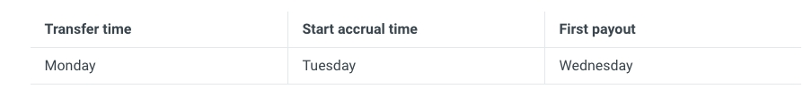

EXINONE CO., LIMITED ("ExinOne" or the "Company") is a company incorporated in the Republic of Seychelles under the relevant laws of the Republic of Seychelles. The Savings Service Agreement ("Agreement") is a valid contract between ExinOne and the user ("you" or "User") in relation to the Savings Service. This Agreement is a valid contract between ExinOne and the User ("You" or "User") in relation to the Savings service. By clicking "Agree" or otherwise choosing to accept this Agreement on the web page, the User and ExinOne agree and consent to all of the agreed contents of this Agreement and all rules, page prompts, operating procedures, announcements and notices that have been or may be issued in the future in connection with this Agreement (collectively, the "Agreement"). ("Agreement").Please read this Agreement carefully and in its entirety before accepting this Agreement. Make sure you fully understand the terms of this Agreement and all other rules and regulations governing the ExinOne Site. If you do not agree with any of the contents of this Agreement, or if you cannot accurately understand our interpretation of the terms, please do not proceed.Both parties mutually acknowledge that
As with any asset, the value of digital assets may fluctuate upward and downward and are subject to significant risks (including, but not limited to, information security risks, property security risks, regulatory and policy risks, etc.), and both parties acknowledge that they understand the above risks.
There are a number of risks associated with the use of any digital asset network, including, but not limited to, the risk of unknown vulnerabilities or unpredictable changes in the digital asset network and its processes. User agrees that ExinOne has no control over any Digital Asset Network and shall not be liable for any damages arising from such risks.

## I. definitions and descriptions
Except as otherwise provided in this Agreement, the following terms shall have the following meanings.
Saving Service: means the service provided by the Company to the User that allows the transfer of transaction funds and the inquiry of transaction information through the Company's system.
Identification elements: means the information elements used by the Company to identify the User in the transaction, including but not limited to the User's escrow account name, SMS verification service, telephone number set at the time of signing, cell phone number, etc. and other elements approved by the Company.
Current account is a sub-account of the user and is a centralized account.Transfer in means the operation of transferring funds from the Wallet Account to the Savings Account.transfer out means the operation of transferring out from the Savings account to the Wallet account.The types of digital assets currently supported by Savings, including but not limited to USDT, XIN, EOS, etc.
Daily Return: means the number of digital assets converted from the interest-bearing balance to one day at an annualized rate of return.Accumulated Return: means the sum of the accumulated historical returns issued to you by LivePay.Annualized yield: refers to the yield calculated based on 360 days/year.

## II. Special Notice

1. Users are not allowed to provide their accounts to any third party or allow any third party to use them. Users shall be responsible for the consequences of such actions. All risks, liabilities, losses, costs, etc. arising from the unauthorized use, theft, or illegal use of accounts, passwords, and other information not caused by the company shall be borne by the users themselves.
2. You understand and agree that the fund transfer instructions submitted by you online shall be recorded by the company's system. You can check the net amount, income, transaction details, and other information of the financial products you hold in "Huoqi Bao". However, such data is for reference only, and all data shall be subject to the corresponding "Huoqi Bao" system data.
3. You confirm and promise that when you complete the registration process or actually use the services provided by ExinOne in any other way allowed by ExinOne, you shall have all the qualifications and abilities necessary to sign, execute this Agreement and use ExinOne services. If you do not have the above-mentioned qualifications, you shall bear all consequences arising therefrom, and the company reserves the right to cancel or permanently freeze your account and pursue your responsibility.

## III. Service Description
Savings provides users with pay-as-you-go demand finance service. Each natural day is an interest-bearing cycle.The interest accrual time of Savings is T+1 business days.The first accrual time of each new transfer is shown in the following table.

Transaction history. We will record every transfer in, transfer out and earnings through your account system.No interest will be paid on the same day for the portion of each new transfer amount from Savings.Suspension or Revocation. You are aware of the "irrevocable" nature of the blockchain system transactions, we cannot suspend or cancel the transfer in or out for you.

## IV. Service Target
The "Savings" service is only available to individual users. You shall not use ExinOne for money laundering, financing terrorism, fraud, or other financial crimes.

## V. Handling of Personal Information
By registering an account with ExinOne or actually using the services provided by ExinOne, you agree to provide the personal information requested for identity verification purposes. This information is used exclusively for the purpose of uncovering leads on money laundering, terrorist financing, fraud and other financial crime activities conducted on ExinOne. We will collect, use and share this information in accordance with our Privacy Policy, as published and updated from time to time. In addition to providing this information, in order to comply with global industry standards for data retention, you agree to allow us to retain a record of this information for the life of your account and for 5 years after account closure. You also authorize us, either directly or through a third party, to conduct investigations necessary to verify your identity or to protect you and/or us from financial crimes such as fraud.Because your information is collected for the purpose of complying with the provisions of national laws and regulations or regulatory requirements and/or for the purpose of providing and improving the quality of the Service to you, in order to achieve the foregoing purposes, we use your information for purposes including, but not limited to, the following.Providing the Service to you and maintaining and improving the Service.To compare the accuracy of information and to verify it with third parties.To send you notices of the status of the Service, marketing campaigns and other commercial electronic messages in order to keep you informed of your use of the Service or to learn about the Service. If you do not wish to receive such messages, please unsubscribe as prompted by the message after you receive the marketing message.To enhance your service experience and improve service quality, or to prevent risks, or to recommend better quality or more suitable services for you, to process your information, etc. for comprehensive statistics, analysis or processing.To prevent or prohibit illegal activities.Administrative and judicial authorities in accordance with the lawful requirements of the law and administrative regulations.

## VI. Special agreement
You agree that the Company shall not be liable for any delay, service interruption or failure to perform directly or indirectly due to reasons beyond our reasonable control, including but not limited to the following circumstances.During downtime of our systems for maintenance or upgrades.Force majeure factors such as extreme weather, catastrophic events, terrorist attacks, war, strikes, etc., resulting in the failure of our system to perform its normal operations.Failure of your computer software and hardware and communication lines and power supply lines.Your improper operation or use of our services by means other than those authorized or approved by the Company.Interruption or delay of the Service due to viruses, Trojan horses, malicious program attacks, network congestion, system instability, system or equipment failure, communication failure, power failure, banking reasons, third party service defects or government actions.The Company shall not be responsible for any liability arising from the illegal use of the account or password by others due to the user's negligent storage.Other reasons not attributable to the custody account of liquid digital assets.Other reasons not attributable to the Liquidity Digital Asset Custodian Account.In the event of the above, the Company will take reasonable action to actively promote the return to normal service.

## VII. Notices and Changes to the Agreement

We reserve the right to amend this Agreement from time to time and to announce such changes by way of posting on the Website without further separate notice to you. The changed Agreement will be marked on the first page of this Agreement with the time of the change and will automatically become effective upon posting on the Website. You should browse and pay attention to the updated time and updated content of this agreement from time to time, if you do not agree to the relevant changes, you should immediately stop using the services of this website; your continued use of the services of this website means that you accept and agree to be bound by the revised agreement.

## VIII. Service Fees
You know and agree that the Company reserves the right to charge you service fees. Once we determine the method and standard of charging or adjusting the service fees, we will notify you by posting an announcement in the Savings application without further individual notice. Unless otherwise stated or agreed, you agree that we have the right to deduct the above service fees directly from the money or any other assets you entrust to us for safekeeping.

## IX. General Provisions

This Agreement and other terms and rules on this website and the corresponding explanation of terms and understanding of meanings may be cross-referenced, and this Agreement shall prevail in case of different understandings. If this Agreement does not provide, other terms and rules on the Company's website shall prevail.If part of the terms and conditions of this agreement is found to be invalid by a court of competent jurisdiction, it does not affect the validity of other terms and conditions.In order to provide better and more stable services, the Company reserves the right to change, upgrade or correct the terms of this Agreement at its sole discretion. Newly formulated and modified rules will be published on this platform without individual notice, and will take effect immediately upon publication.
