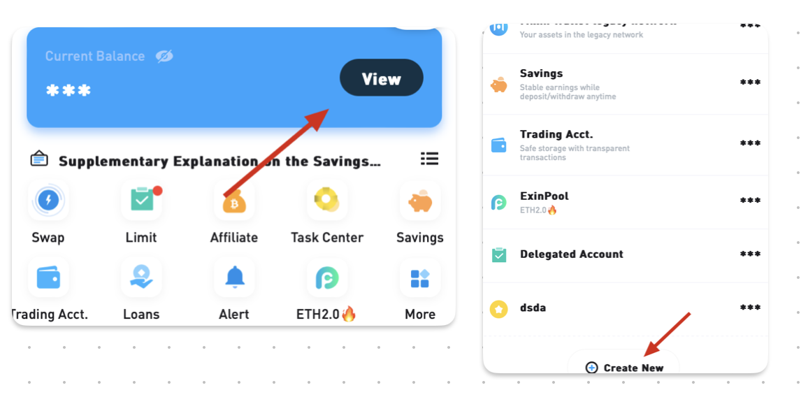

In practical use, you might be confused about "How much are my assets worth now?" Your assets might be invested in wealth management, engaged in market making, stored in other wallets, or temporarily transferred to another account of yours. Currently, no product can clearly display the situation of all your assets.

You can use the "Add Account" feature provided by ExinOne to record your asset situation as completely as possible.

**What assets does ExinOne default to displaying?**

By default, ExinOne displays the assets in your (new and old) Mixin wallets, Huobi Bao, trading accounts, and assets within ExinPool.

**How can I add assets from my other accounts?**

Through the above entrance, create a new account, add the corresponding assets you hold, enter the respective numbers, and you can complete the statistics for this asset.

------