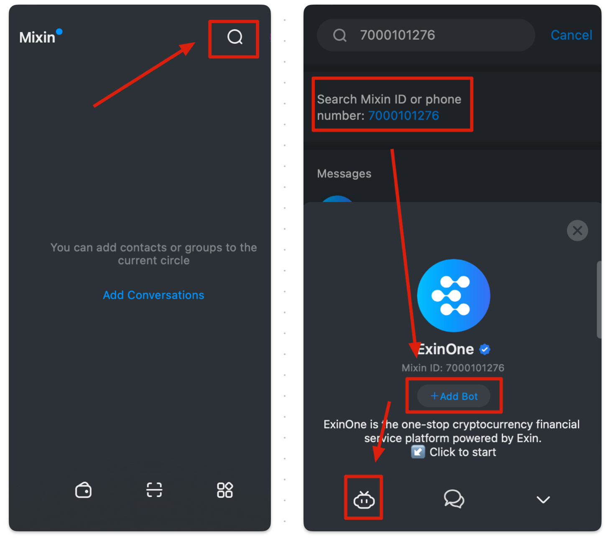
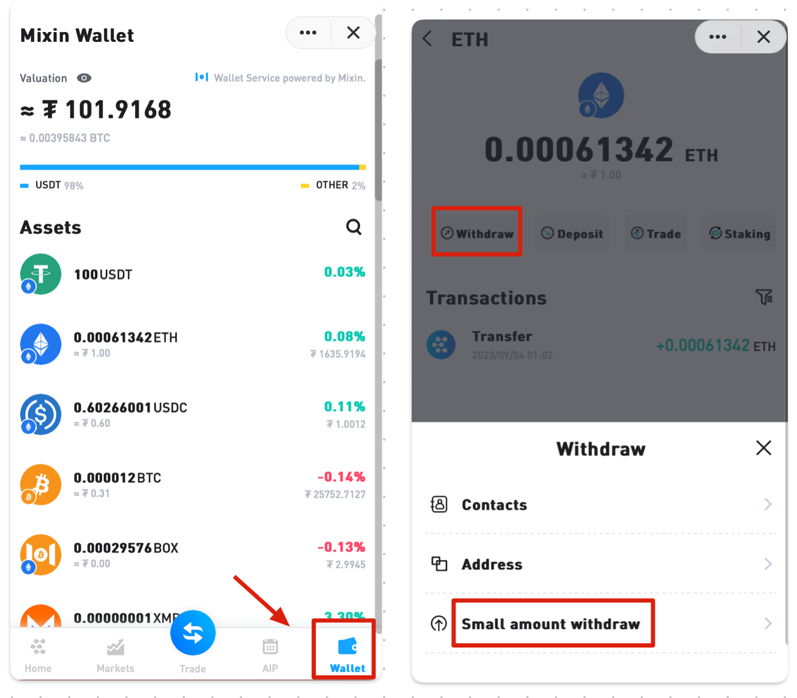

ExinOne has now launched the "Small amount withdrawals" service, which is designed to help you save some costs when withdrawing tokens from the chain, and currently supports the following tokens:

> BTC｜ETH｜BNB｜TRX

ExinOne will continue to provide Small amount withdrawal service for more tokens, the tokens under planning are:

> USDT-ERC20 ｜USDT-TRC20 | USDT-BEP20 | USDC-ERC20
>
> BTC - Lightning Network (Deposit & Withdraw)

Through the "Small Amount withdrawal" feature you can withdraw coins with a lower withdrawal fee, the current standard of "Small" is about less than $1000, the actual results please refer to the page display.

**How to use?**

1. Mixin search Bot ID: 7000101276 Add to use it

2. On ExinOne's wallet page, find the tokens that support Small Amount withdrawal, and select "Withdraw" to see the Small Amount withdrawal option.

Please note: If you need to withdraw a large amount of coins, this feature may not be able to meet your needs, so we recommend that you make a comparison before using it and choose the right option for you.

