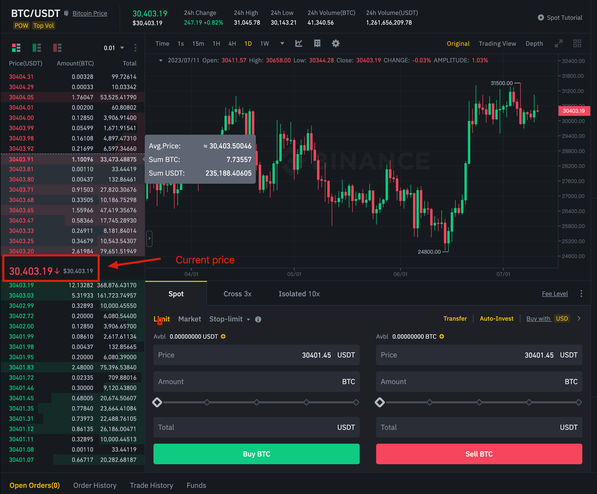
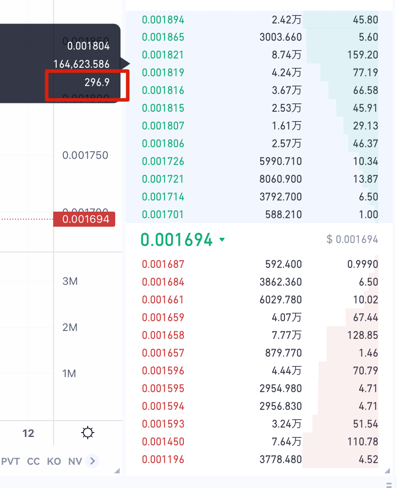

"Trading depth" is a financial term that is often used to describe the liquidity of a market. It can be measured by the number and size of buy and sell orders. The higher the trading depth, the better the market's liquidity, meaning it's easier to buy or sell large quantities of security without affecting its price.

In cryptocurrency trading, trading depth is often represented by a "depth chart" or "order book," which shows the buy and sell orders in the market. The X-axis of the depth chart represents the price, and the Y-axis represents the cumulative market order quantity. Buy orders (bids) are typically on the left, and sell orders (asks) are on the right. This type of chart can help traders understand market liquidity and price pressure.

In summary, trading depth is an important market indicator that can help traders understand the liquidity and stability of a market.

As shown above, the current price of BTC is 30403.19 USDT, if you buy 235188.4 USDT, the price of BTC will increase to 30403.91 USDT, which means that the price of BTC will increase by 0.72 USDT.

For some coins with bad trading depth, as shown below, it's possible that a very low amount could have a big price impact.

Therefore, ExinOne will inform you of the price impact through a pop-up window before you trade, so please understand the price impact before making a judgment.
