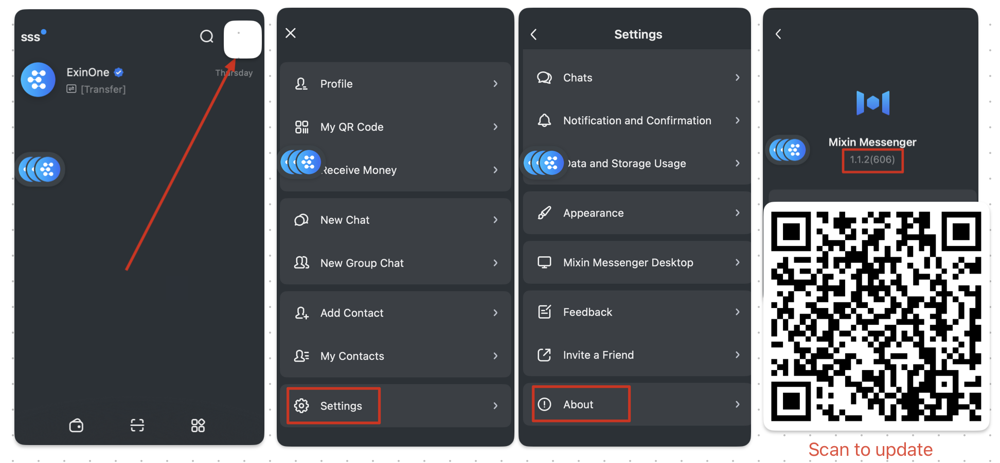
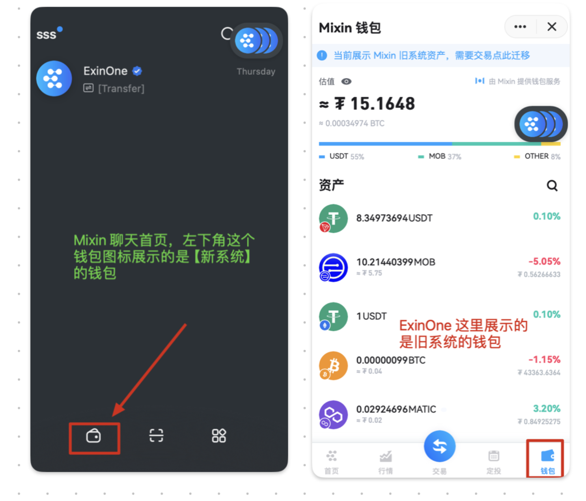

Q: How do I check the version number?

A:

Q: What is the new system, and what changes does it entail? 

A: The Mixin App comes with a Mixin wallet. Now, Mixin has launched a new version of the Mixin wallet, replacing the original one. 

Therefore, the original wallet has become the "old system wallet." 

The ways to view them are as follows:

Q: How do I migrate? 

A: As shown in the image below, enter your Mixin wallet and click on the blue frame to follow the guide for migration.

Q: How do I use the coins after migration, and why doesn't ExinOne display the assets? 

A: ExinOne has not yet accounted for your assets and their value in the new system Mixin wallet, so you can understand it as:

Your actual assets (value) = Assets (value) displayed by ExinOne + Assets (value) in the new system Mixin wallet + Others (you may have some assets elsewhere).

Q: How do I trade? 

A: You can trade through ExinOne as usual, with no difference from the previous method of operation. 

Note that when you sell assets to the [Mixin Wallet], the assets will be transferred to the new system's Mixin wallet. You need to check your wallet on the Mixin homepage.

