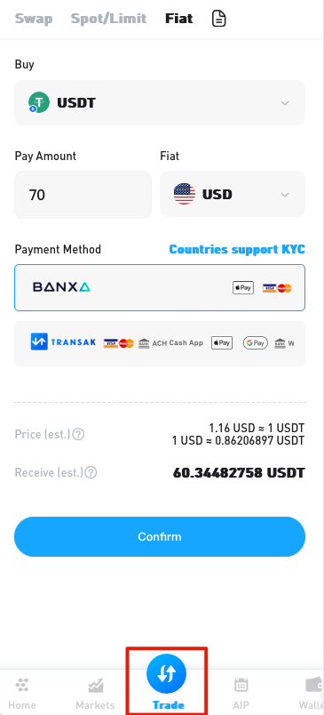
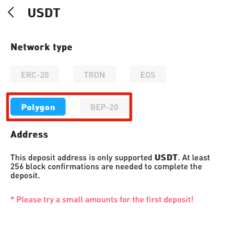

Welcome to ExinOne 👏

ExinOne is a "one-stop digital asset and financial services platform" that mainly offers you services in the following five areas:

- Market: You can view cryptocurrency market information and set price alerts through ExinOne;
- Trading: ExinOne aggregates exchanges like Binance, OKX, Bybit, Gateio, BigONE, and MixSwap, allowing you to trade tokens from these exchanges without registration or KYC. There are currently three trading modes:
  - Instant Swap: You can trade any coin with any other coin, and ExinOne will automatically choose the best trading path for you;
  - Spot Trading: Connect to exchanges for trading, with the option to choose market price or limit price (placing orders);
  - Fixed Investment: You can make single-coin/multi-coin fixed investments through ExinOne;
  - In the future, ExinOne will offer more strategic trading features, so stay tuned.
- Wealth Management: ExinOne's "Current Treasure" feature provides wealth management services for some assets, currently supporting:
  - USDT, pUSD, XIN, ZEN, EOS
- Lending: ExinOne offers collateralized lending services, allowing you to pledge your assets and borrow USDT.
- Wallet: ExinOne integrates the functionality of the Mixin wallet, enabling you to query and operate your Mixin wallet assets within ExinOne.

## User Guide 

## Deposit 

**Introduction to concepts** 

USDT: A stablecoin in the blockchain, which can be used to trade any cryptocurrency 

Deposit: Obtain USDT

**Two ways to deposit** 

Method 1: Fiat currency deposit 

Fiat currency deposit refers to using Fiat to purchase USDT. 

Open ExinOne, Click "Trade" - "Fiat"

Method 2: On-chain deposit

If you have cryptocurrencies in other exchanges or on-chain wallets, you can deposit the corresponding cryptocurrencies into Mixin for trading. If available on an exchange, it is recommended to choose the USDT-Polygon version or USDT-Bep20 version, as their withdrawal fees are relatively lower. Within Mixin, do not use USDT-ERC20 or ETH addresses for depositing, as different deposit addresses may cause your deposited coins to not arrive. On the USDT deposit page, please select the correct version of USDT for depositing, as shown below:

For first-time deposits, try a small amount first. Once you confirm the deposit has arrived, proceed with larger amounts to avoid unnecessary losses due to incorrect addresses.

#### Feature Introduction 

Market ExinOne's "Home" page displays market information for the supported tokens, with price data coming from the connected exchanges. Prices can be calculated in two ways, adjustable through the "Pricing Method" within the user avatar on the top left corner of the ExinOne homepage. The "Market" page displays the top 300 tokens on Coingecko and tokens supported by ExinOne for trading. You can bookmark the tokens you are interested in, set price alerts, and if the relevant token is tradable, you can choose instant swap, spot trading, place orders, or fixed investment. Trading ExinOne aggregates Binance, OKX, Bybit, Gateio, BigONE, and MixSwap exchanges, allowing you to trade tokens from these exchanges without registration or KYC, ensuring privacy and security. ExinOne offers three trading modes: Instant Swap, Spot Trading, and Placing Orders.

**Swap**

You can use the "Instant Swap" feature to exchange any coin for any other coin, and ExinOne will automatically choose the appropriate trading path for you. If the Instant Swap feature does not have the token you want to trade, please leave a message to the ExinOne bot, and we will evaluate and inform you if we can support it.

**Spot Trading & Limit Orders**

Spot trading uses the depth of the connected exchanges, and you can perform market price and limit price trading through the Spot Trading page.

**Auto Invest Plan**

ExinOne supports creating your investment portfolio for periodic fixed investments. Deposit USDT in advance into the "Worry-Free Investment Exclusive Account" and "Current Treasure" to make fixed investments according to the rules when the balance is sufficient.

**Loans**

ExinOne offers collateralized borrowing services. Pledge assets in the trading account to obtain a borrowing limit, and you can borrow funds. The borrowing period is 365 days, and you can repay at any time. Please avoid overdue payments, control the collateralization rate, and avoid liquidation risks.

**Savings**

ExinOne provides wealth management services for specific tokens.

#### Function Module Introduction 

Trading Account: The trading account is an account provided by ExinOne for Mixin users to directly trade tokens from various exchanges within Mixin.

Current Treasure: This feature offers token current wealth management services. USDT and pUSD deposited in Current Treasure can also be used for fixed investment payments.

Delegation Account: The tokens you place as orders will be held in this account. Once the order is completed (including cancellation), the assets you have entrusted will be returned to your payment account.

Developer Documentation: ExinOne provides developer documentation, which can be used to integrate and utilize the services provided by ExinOne.
