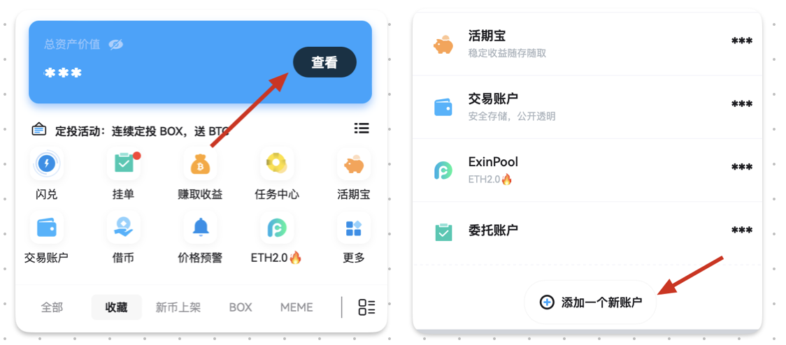

在实际使用中，您可能会遇到“我的资产现在值多少钱“的困惑，资产可能拿去理财了，可能去做市了，可能存在别的钱包里了，可能暂时转到自己的别的号里存着了，没有一个产品能够清楚您的所有资产的情况。

您可以通过 ExinOne 提供的「添加账户」功能，尽可能全地记录自己的资产情况。

**ExinOne 默认展示哪些资产？**

ExinOne 默认展示您的 （新旧）Mixin 钱包的资产，活期宝的资产，交易账户和 ExinPool 内的资产。

**怎么添加自己其它账户的资产？**

 

 

通过以上入口，创建一个新账户，添加您持有的对应资产，输入对应的数字，就可以完成对此资产的统计了。