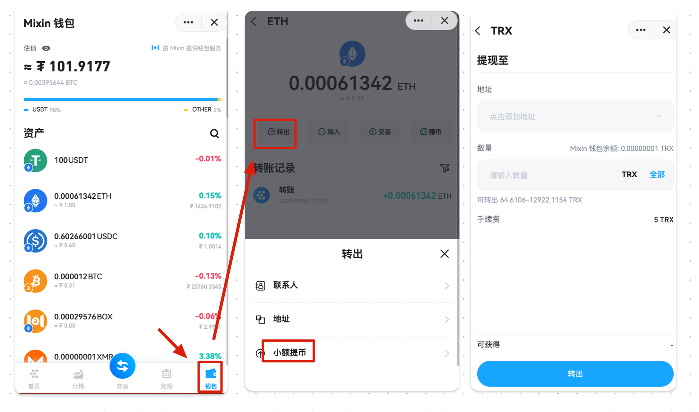

ExinOne 现已推出“小额提币”服务，旨在帮助您在链上提币时节省一定成本，目前支持的代币有：

> BTC | ETH | BNB | TRX

ExinOne 会持续为更多代币提供小额提币服务，计划中的代币有：

> USDT-ERC20 | USDT-TRC20 | USDT-BEP20 | USDC-ERC20
>
> BTC - 闪电网络（充提）

通过“小额提币”功能，您可以以一个较低的提币费用进行提币，目前“小额”的标准大约是小于 1000$，实际结果请以页面展示为准。

怎么使用？

1. 找到 ExinOne 机器人，在 Mixin内搜索 7000101276，添加后使用

2. ExinOne 的钱包页面，找到以支持小额提币的代币，选择「提现」，即可看到小额提币的选项。

请注意：如果您有大额提币需求，此功能不一定能满足您的需求，建议在使用前进行对比，选择合适自己的方案。