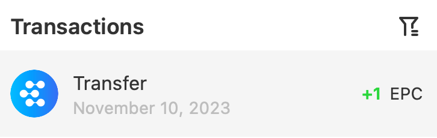

ExinOne 定投的流程是：您主动或者被动（将资产存入省心投账户）定投了一个或者若干个代币，定投完成后，ExinOne 会根据代币的情况，可能将您定投所得的资产转入两个账户内：

- Mixin 钱包
- 交易账户

同时，ExinOne 会给您记录您定投时刻投入的资产价值，得到的资产数量，随着时间的推移，为您记录定投的收益率 —— 这个收益率是假定您并未卖出您所定投的资产而作出的。

如果您定投了一些币之后，后来把它卖掉了，ExinOne 并不能统计这部分数量，如果您通过别的渠道，比如币币交易，比如理财收入获得了一些额外的币，这些币也不会进入定投数据统计上。

所以：定投的收益率情况是默认您一直持有您定投的资产的收益数据。

那么，为什么钱包里币的数量跟定投的不一致呢？

刚才其实已经解释了，有以下可能：

1. 币卖掉了
2. 币转到别的地方去了
3. 币在旧系统里没迁移

如果您是 2024/1/1 之前定投的资产，建议通过 旧系统 Mixin 钱包查询自己的资产情况，方法如下：

1. 查看自己历史定投了什么币，比如 BOX
2. 通过搜索机器人：7000101500，查看自己 BOX 的转账流水
3. 其中  + xxx 代表 得到了多少，例如下图，代表 2023 年 12 月 10 日，ExinOne 给我转了 1 EPC

4. 您可以通过上图的图标来判断转账来自 ExinOne
5. 通过查询币的流水，可以知道自己资产的转移记录，从而确定资产的用途
   1. 如果是 -xxx BOX 给 ExinOne，那么很可能是把 BOX 卖掉了
   2. 如果除了 -xxx BOX之外，还经常收到一些 BOX，那可能是您拿 BOX 去理财了
   3. 您还可能把 BOX 转给了朋友，或者通过 TIGA 等平台卖掉了。
6. 另外要补充的是：比如您拿 BOX 去参与理财了，这部分资产在 Mixin 钱包上是不显示的，您得去对应产品上查看资产。